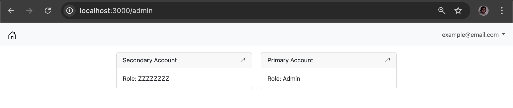

# Ecom Portal

In lieu of any ideas of anything to build, I'm just rebuilding an ecom platform but with blackjack and hookers. ¯\\_(ツ)_/¯

Plans:
  - Rails B/E & Admin
  - Jsonapi resource api
  - Graphql api (? maybe)
  - Kafka (microservice "synergy")

Features:
  - PIM
  - Auth
  - CMS
  - Carts
  - OMS
  - ...

Admin Panel/Portal:
  - Rails
  - Turbo
  - Bootstrap
  - Mini React apps (complicated forms, promotions flashbacks)

[Api Docs]() (Coming Soon)

[See Admin](/docs/admin.md)



### Booting

#### Production:

N/A

#### Dev: 

```bash
docker-compose up --watch
```

Site available at `localhost:3000`
Sidekiq admin available at `localhost:3000/sidekiq`
Email host available at `localhost:1080`

Command line works as usual:
 
```bash
rails c
rspec
```

While inside a console you should almost always wrap your actions within the account switching logic
```ruby
Switch.account("account_reference") {binding.pry}
Switch.current_account # => "account_reference"
```
