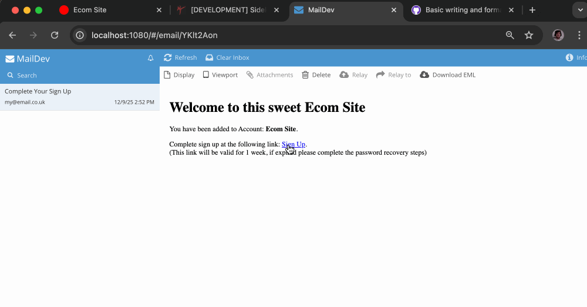
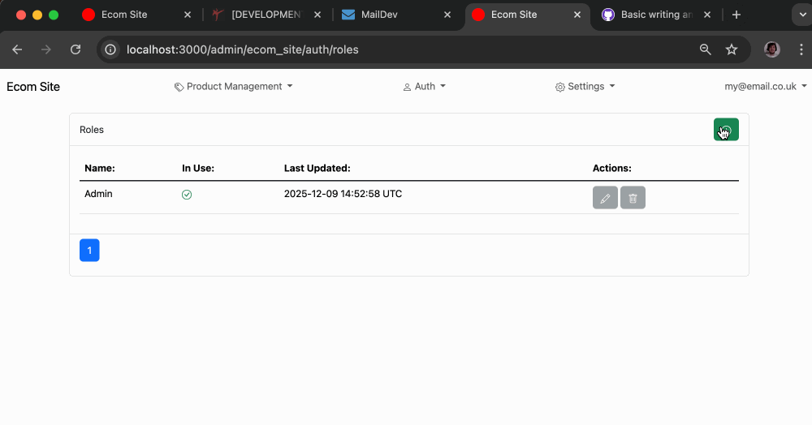
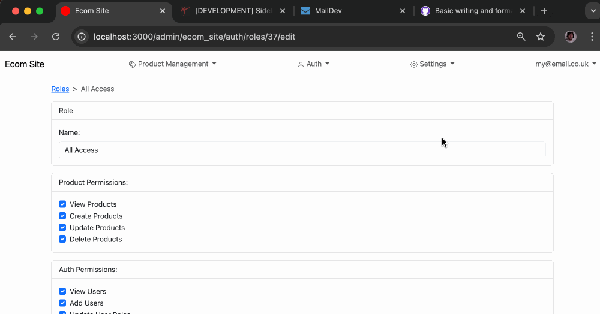

# Admin

(Written as though this is sorta official client documentation)

### 1. Getting Started

Once you're account has been created your system admin should have received an email notifying them with a User sign up completion link, or they can sign in using their login details from a pre-existing account. Once completed you can get started adding other Users, importing Products, creating content.

### New Users

Add new Users and define new Roles to delegate what that User is allowed to do within your account.

### New ADMIN Users

Only as an Admin User can you assign the Admin role to another user. But it is recommended to do this sparingly as admin users have global access and are the only other Users that can interact with other Admin Users.

