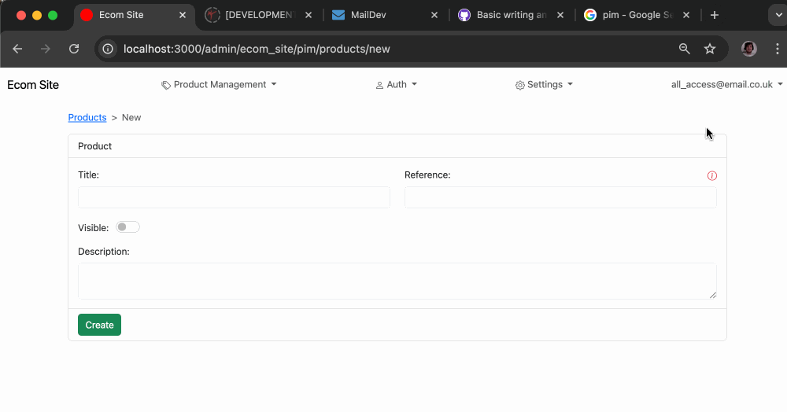
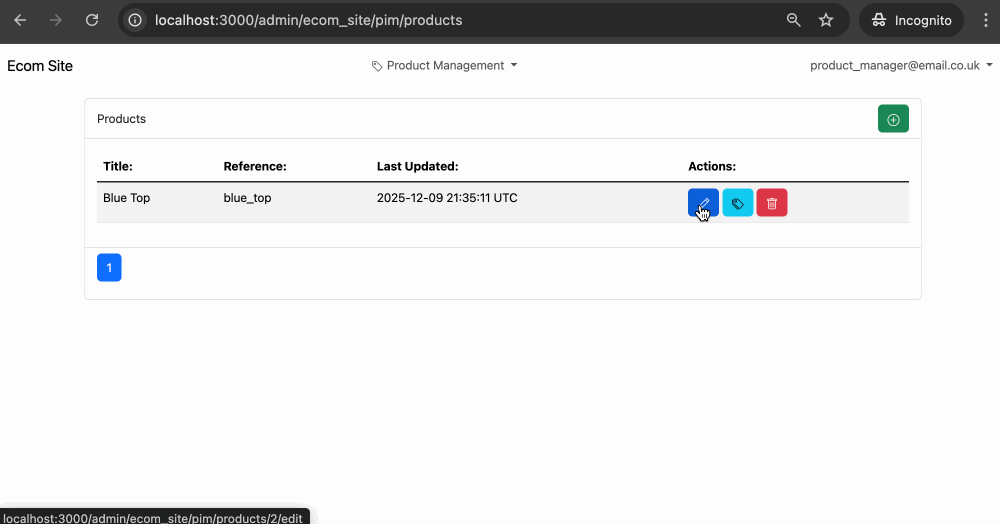

### [<< Back](/docs/admin.md)

# Product Management (PIM)

## Products

Products can be added.
Reference is a field meant for syncing your Products across services and cannot be updated once created. Changing a Product's reference is the same as adding a new Product
Visible manually dictates whether a product should appear in searches or be able to be added to carts or ordered.

## Variants

Variants are the individually purchasable part of a product, a Variant may vary on a product based on size or colour for example.
Reference is a field meant for syncing your Variants across services and cannot be updated once created. Changing a Variant's reference is the same as adding a new Variant
Visible manually dictates whether a variant should appear in searches or be purchased.
Variants are ordered by their position. When a position is updated to an already existing position all positions get increased to allow the new position to take that spot.

