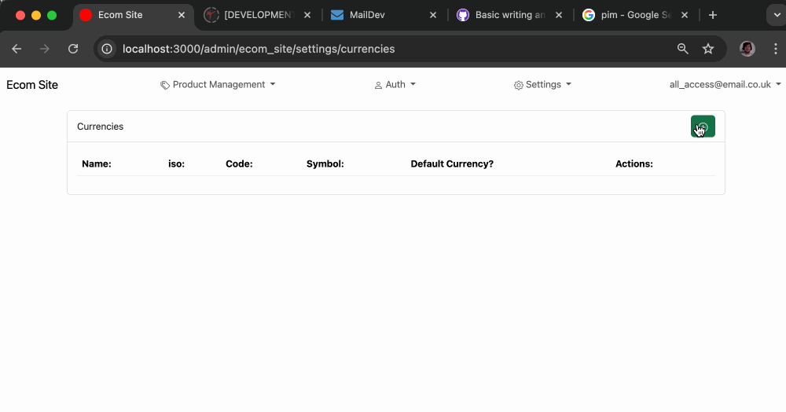
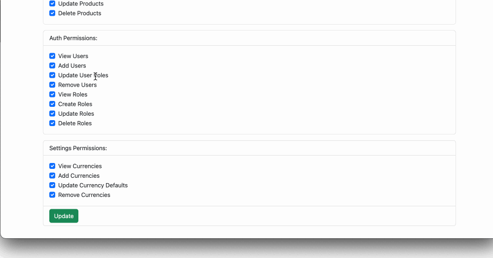

### [<< Back](/docs/admin.md)

# Setting

## Currencies

While multiple currencies can be added with one default currency per account allowed, which will be the prices rendered through the API will match unless another currency is specified.

Without the permissions to modify default Currencies you can only view the current default Currency. New or existing Currencies cannot be made or removed as the default.

